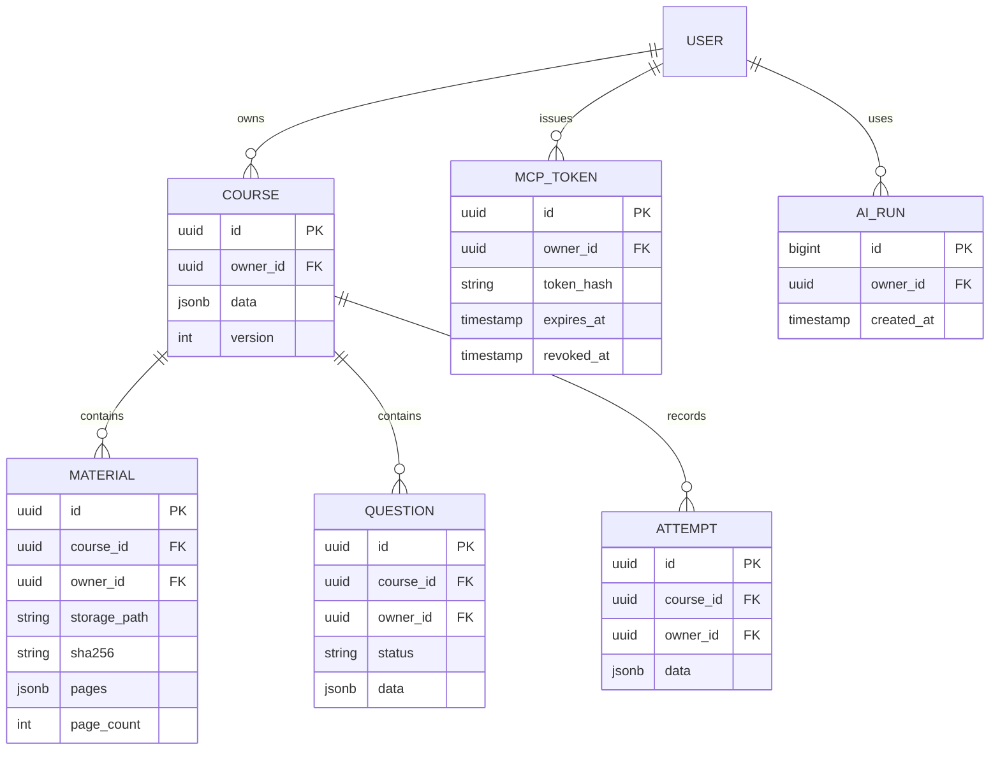

# 구조와 ERD

Vite로 기존 화면을 묶고, Vercel `/api` Node 함수가 Supabase 인증·학습 처리·문제 생성·MCP를 제공합니다. PDF는 브라우저에서 비공개 Storage에 직접 올려 Vercel 요청 본문 크기 제한을 피합니다. PDF를 외부 AI로 전송하는 작업은 생성 버튼에서 명시적으로 시작합니다.

`USER`는 Supabase `auth.users`, 나머지는 `public.crammate_*` 테이블입니다. 파일럿에서는 개념·숙련도 배열을 Course.data에, 문항 내용은 Question.data에, 응시 당시 문항 스냅샷과 답안은 Attempt.data에 둡니다. 강좌 단위 관계와 소유권은 FK로 분리하되 내부 학습 모델은 JSONB로 시작합니다. 공유 강좌·통계 분석 확장 시 개념·문항별 답안·실제 시험 결과를 별도 테이블로 분리해야 합니다.

## 데이터 경계

- 일반 요청은 Supabase `auth.getUser`로 검증하며, RLS와 owner_id 필터를 함께 적용합니다.
- MCP 토큰은 서버에서 해시로 검증합니다. 서비스 키 경로에도 소유자 필터와 `(course_id, owner_id)` 복합 FK를 유지합니다.
- `crammate_save_attempt`와 `crammate_submit_questions`는 version 비교와 트랜잭션으로 동시 수정 손실을 막습니다.
- 비용 한도 함수만 SECURITY DEFINER입니다. 호출자의 auth.uid, 고정 search_path, authenticated 실행 권한, 직접 테이블 변경 금지를 적용합니다.
- 채점은 결정적 규칙입니다. 숙련도는 정답 +0.1, 오답 -0.1의 파일럿 휴리스틱이며 검증된 능력 추정치가 아닙니다.
- 현재 지표는 학습 보조용입니다. RLS는 다른 학생을 격리하지만 본인이 REST를 직접 호출해 본인 데이터를 편집하는 것까지 막는 공인 시험 시스템은 아닙니다.
- 공개 문제은행, 결제 권한, 성적 예측 모집단은 이번 범위에 포함하지 않습니다.
